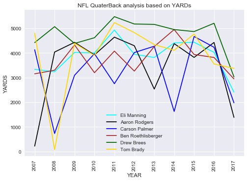
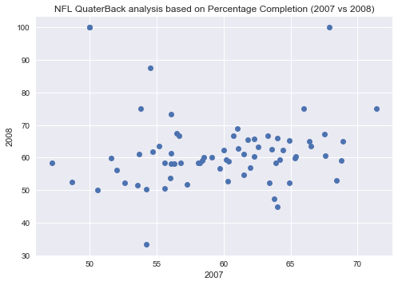
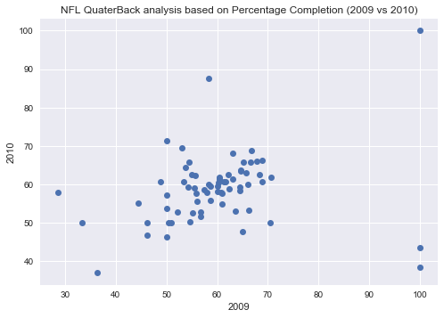
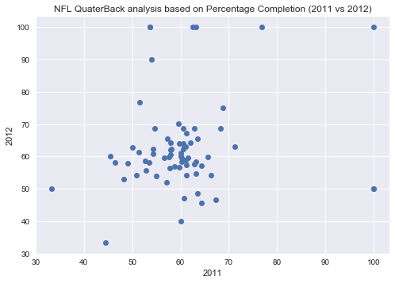
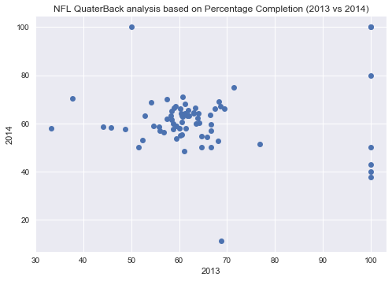
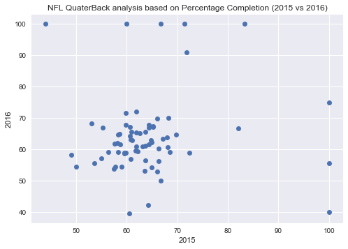
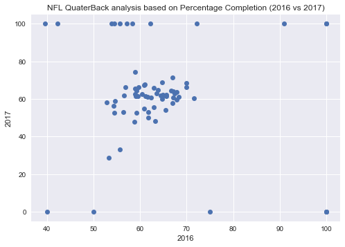

# NFL Football Player Analysis
             


_The NFL football dataset is a scraped data from the espn.com.This Data was scraped usig program written python 3.6. It contains details of all players whoo played in the NFL game from the year 2007-2017.Data contain different fields about the players contributions._


### Tools
	* Anaconda
	* Jupyter Notebook

### Libraries and Packages required
	_In order to analyze the data set, we have to import the following libraries.(For the current github code)_
	* pandas
	* matplotlib
	* IPython
	* seaborn
	* numpy
	

#### What are we analysing?
  _Using this dataset we are trying to analyse the top 6 players who played the NFL from
	2007-2017, all the 11 years.Also using this data set we are trying to analyze the data   of previous years percentage completion._
		
_To analyse a data, we have to read the cvs file, which can be done using pandas._
_Below snipet will help to understand, how we can read a csv file._

```python
ofns = pd.read_csv("nfl_offense_cleaned.csv")
```

      
#### *How to plot graphs of the data analyzed?*

_We have to first collect some data from the csv file, so that we can input our data to the graph._

In this example, the graph ploted are line graphs and scatterplot.Both graphs represent two different anaysis of the data set.

  - Analysis of top 6 players who played the NFL from the year 2007-2017.
  
  - Analyse the percentage completion of all the players through out the years 200-2017.


### Code Analysis


#### Analyzing the columns and rows using the Apis head and tail

_it gives irst few columns and rows in the tat frame_

```python
h1b.head()
```
|RK|PLAYER|POS|TEAM|COMP|ATT|PCT|YDS|YDS/A|LONG|TD|INT|SACK|RATE|YDS/G|YEAR|	
|---|:-----------:|:-----------:|:--------------:|:------------:|:-----------:|:-----------:|:--------------:|:------------:|--------------:|:-----------:|:-----------:|:--------------:|:------------:|:-----------:|:-----------:|
|1|Tom Brady|QB|NE|279.0|408.0|68.4|3374.0|8.27|640|26.0|3.0|24.0|111.7|307.0|2017.0
|2|Kirk Cousins|QB|WSH|249.0|376.0|66.2|3038|8.08|74.0|19.0|6.0|31.0|101.1|276.0|2017.0
|3|Drew Brees|QB|NO|2660|373.0|71.3|3029.0|8.12|54.0|16.0|5.0|130|104.0|275.0|2017.0|
|NAN|Russell Wilson|QB|SEA|256.0|411.0|62.3|3029.0|7.37|66.0|23.0|8.0|26.0|95.2|275.0|2017.0|
|5|Matthew Stafford|QB|DET|247.0|395.0|625|3010.0|7.62|63.0|21.0|6.0|36.0|97.3|274.0|2017.0|

#### Dropinh the NAN ,if present in all the line of the row.
```python
ofns = ofns.dropna(how='all')
```

#### Deleting unwanted columns for Analysis

_Creating two different data frames to analyse the two graphs._

```python
ofns_t = ofns.drop(ofns.columns[[0]], axis=1)
ofns = ofns.drop(ofns.columns[[0,3,5,8,9,11,12,14]], axis=1)
```

#### Grouping the player postion to quaterbacks

```python
ofns = ofns[ofns["POS"] ==" QB"]

```
#### Finding the player who played all the 11 years.
_Using value count we can find the players instances and identify the players_
```python
ofns["PLAYER"].value_counts()
```

#### Creating a name of top 6 players in the dataset

```python
players = ["Eli Manning","Aaron Rodgers","Carson Palmer","Ben Roethlisberger","Drew Brees","Tom Brady"]
```

#### Creating Dataframe for Top 6 players who played all the years from 2007 - 2017
_Here we are extracting data of only the player we need, by searching through the the players column.And then sorting them according to the years for ploting. _


```python
Manning = ofns['PLAYER'].map(lambda x: x.startswith(players[0]))
manning = ofns[Manning]
manning = manning.sort_values('YEAR')
```
**Note :** _Similar code for the data frame of other players_

#### Plot graph for the Top 6 players who played all the 11  years based on completion rate

**_Ploting Line graph plot for the top 6 players from the year 2007-2017._**
 
```python
# Ploting the graph for count of Yards based on Year
objects = ("2007","2008","2009","2010","2011","2012","2013","2014","2015","2016","2017")

y_pos = np.arange(len(objects))

performance0 = manning["YDS"]
performance1 = aron["YDS"]
performance2 = carson["YDS"]
performance3 = ben["YDS"]
performance4 = drew["YDS"]
performance5 = tom["YDS"]

plt.plot(y_pos, performance0, label = players[0],color='aqua')
plt.plot(y_pos, performance1, label = players[1],color='black')
plt.plot(y_pos, performance2, label = players[2],color='blue')
plt.plot(y_pos, performance3, label = players[3],color='brown')
plt.plot(y_pos, performance4, label = players[4],color='darkgreen')
plt.plot(y_pos, performance5, label = players[5],color='gold')

plt.xticks(y_pos, objects,rotation=90)
plt.xlabel('YEAR')
plt.ylabel('YARDS')
plt.title('NFL QuaterBack analysis based on YARDs')
plt.legend()
plt.show()
```
_Below is the graph for the analysis_

 


### Analysing the Percentage of Completion of players for previuos Years.

#### Creating the Data Frame for all the years from 2007-2017.

_Here we are creating data frames for each year seperately.Droping the unwanted columns, that are nt required._

```python
yr2017 = ofns_t['YEAR'].map(lambda x: str(x).startswith("2017"))
year_2017 = ofns_t[yr2017]
year_2017 = year_2017.drop(year_2017.columns[[0,1,2,14]],axis=1)
#Restricting to 70 players,so that we can plot proper scatter plots.
year_2017 = year_2017.iloc[:70]
    
```
**Note :** _Similar code for the data frame of other players_


#### Plot Scatter plot by comparing the percentage of completion for previous years.

_We are poting scatter plot by comparing the percentage of completion with previous years for ex: 2016 vs 2017._

_The Graph helps to understand the performance based on the percentage of completion of Players over previous years._

```python
# Plot Scatter graph for players based on percentage of completion, comparing previous Years.
line = plt.figure()
plt.plot(year_2007['PCT'], year_2008['PCT'], "o")
plt.xlabel('2007')
plt.ylabel('2008')
plt.title('NFL QuaterBack analysis based on Percentage Completion (2007 vs 2008)')
plt.show()
plt.plot(year_2009['PCT'], year_2010['PCT'], "o")
plt.xlabel('2009')
plt.ylabel('2010')
plt.title('NFL QuaterBack analysis based on Percentage Completion (2009 vs 2010)')
plt.show()
plt.plot(year_2011['PCT'], year_2012['PCT'], "o")
plt.xlabel('2011')
plt.ylabel('2012')
plt.title('NFL QuaterBack analysis based on Percentage Completion (2011 vs 2012)')
plt.show()
plt.plot(year_2013['PCT'], year_2014['PCT'], "o")
plt.xlabel('2013')
plt.ylabel('2014')
plt.title('NFL QuaterBack analysis based on Percentage Completion (2013 vs 2014)')
plt.show()
plt.plot(year_2015['PCT'], year_2016['PCT'], "o")
plt.xlabel('2015')
plt.ylabel('2016')
plt.title('NFL QuaterBack analysis based on Percentage Completion (2015 vs 2016)')
plt.show()
plt.plot(year_2016['PCT'], year_2017['PCT'],"o")
plt.xlabel('2016')
plt.ylabel('2017')
plt.title('NFL QuaterBack analysis based on Percentage Completion (2016 vs 2017)')
plt.show()
```

_Below graph is the analysis of the above data_









#### **Conclusion :**

Using the data in the database, the analysis helped to understand that Drew brees was consistant through out the years.There is a drastic drop in 2017 because the season is still going on. We also were able to analyze the percentage of completion data, using scatter plots for previous years.


#### **References : **

##### **DATA Scraped**  
http://www.espn.com/nfl/statistics/player/_/stat/passing/sort/passingYards/year/2017/seasontype/2


#### **Kaggle Site:**
https://www.kaggle.com/jerrinv/nfl-offense-data-analysis/


#### **Author**
**Jerrin Joe Varghese**


